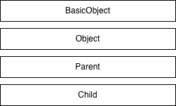

# Effective Ruby

### Ruby User Group Berlin

#### December 2025

Talk by `Dennis Hägler`

---

# Content of the book

- Basics
- Classes, Objects and Modules
- Collections
- Exceptions
- Metaprogramming
- Testing
- Tools and Libraries
- Memory Management and Performance

---

# Removed Topics

- Basics
- Classes, Objects and Modules
- Collections
- Exceptions
- ~~Metaprogramming~~
- ~~Testing~~
- Tools and Libraries - skipping Bundler and Gem Dependencies
- ~~Memory Management and Performance~~

---

# Content for today

- Basics
- Classes, Objects and Modules
- ~~Collections~~ -> `Next Talk`
- ~~Exceptions~~ -> `Next Talk`
- ~~Metaprogramming~~
- ~~Testing~~
- ~~Tools and Libraries~~ -> `Next Talk`
- ~~Memory Management and Performance~~ -> `Stand Alone Talk`

---

# Basics

---

### What is True in Ruby?

---

### What is True in Ruby?

- everything besides `false` and `nil`

---

### What is True in Ruby?

- everything besides `false` and `nil`

```ruby
true == 1 # => false
1 == true # => false
```

---

### What is True in Ruby?

- everything besides `false` and `nil`

```ruby
true == 1 # => false
1 == true # => false
```

```ruby
if 0
  puts("I am true")
end
```

---

### Treat All `object`s as If they Could be `nil`

---

### Treat All `object`s as If they Could be `nil`

- any `object` can be `nil`
- use `nil?`
- use conversion methods (`to_s`, `to_i`)
- use `Array#compact`

---

### Treat All `object`s as If they Could be `nil`

- any `object` can be `nil`

```ruby
person.save if person
person.save unless person.nil?
```

---

### Treat All `object`s as If they Could be `nil`

- any `object` can be `nil`

```ruby
person.save if person
person.save unless person.nil?
```

```ruby
person&.save # since 2.3.0
```

---

### Treat All `object`s as If they Could be `nil`

- use `nil?`
  - `nil.nil? # => true`
- use conversion methods (`to_s`, `to_i`)
  - `nil.to_s # => ""`
  - `nil.to_i # => 0`
  - `nil.to_f #=> 0.0`
- use `Array#compact`
  - `[9, 0, nil].compact # => [9, 0]`

---

### Avoid cryptic Perlisms

---

### Avoid cryptic Perlisms

- Ruby uses special global vars `$`

---

### Avoid cryptic Perlisms

- `$~ ($LAST_MATCH_INFO)`The information about the last match in the current scope (thread-local and frame-local).
- `$& ($MATCH)` The string matched by the last successful match.
- `$' ($POSTMATCH)` The string to the right of the last successful match.
- `$+ ($LAST_PAREN_MATCH)` The highest group matched by the last successful match.

---

### Avoid cryptic Perlisms

```ruby
"Hello World!" =~ /e(llo) (\w+)rl/

puts $~ # => #<MatchData "ello Worl" 1:"llo" 2:"Wo"> (the match and each group)
puts $& # => "ello Worl" (the match)
puts $` # => "H" (the string to the left of the match)
puts $' # => "d!" (the string to the right of the match)
puts $+ # => "Wo" (the last group)
puts $1 # => "llo"
puts $2 # => "Wo
puts $3 # => nil
```

---

### Avoid cryptic Perlisms

- use `String#match`

```ruby
m = 'Hello World!'.match(/e(llo) (\w+)rl/)
puts m[1] # => llo
```

---

### Constants Are Mutable

---

### Constants Are Mutable

- Constants are actually identifiers
- class names are identifiers and so constants

---

### Constants Are Mutable

```ruby
class Testing
  CONSTANT = ['123', 'abc']
end

Testing::CONSTANT # => ['123', 'abc']

Testing::CONSTANT.delete_if {|test| test.to_i.zero?}

Testing::CONSTANT # => ['123']
```

---

### Constants Are Mutable

```ruby
class Testing
  CONSTANT = ['123', 'abc'].freese
end

Testing::CONSTANT.delete_if {|test| test.to_i.zero?}
```

`'Array#delete_if': can't modify frozen Array: ["123", "abc"] (FrozenError)`

---

### Constants Are Mutable

```ruby
class Testing
  CONSTANT = %w[123 abc].freeze
end


Testing::CONSTANT = 'ja moin'
puts Testing::CONSTANT # => 'ja moin'
```

---

### Constants Are Mutable

```ruby
class Testing
  CONSTANT = %w[123 abc].freeze
end

Testing.freeze

Testing::CONSTANT = 'ja moin'
```

`can't modify frozen #<Class:Testing>: Testing (FrozenError)`

---

### Pay Attention to Run-Time Warning

```ruby
class Testing
  CONSTANT = %w[123 abc].freeze
end

Testing::CONSTANT = 'ja moin'
```

---

### Pay Attention to Run-Time Warning

```ruby
class Testing
  CONSTANT = %w[123 abc].freeze
end

Testing::CONSTANT = 'ja moin'
```

`testing.rb:5: warning: already initialized constant Testing::CONSTANT`
`testing.rb:2: warning: previous definition of CONSTANT was here`

---

# Classes, Objects and Modules

---

#### Object

- instance of a class
- container of variables
  - as **instance variables**
  - state of an `object`
- special internal variable to "class type"

---

#### Class

- a class is a **container** of methods and constants
  - referred as **instance methods**
  - behavior of the `object`

```ruby
class MyClass
  def instance_method
  end
end

MyClass.new.class # => MyClass
```

---

#### Classes are also Objects

- with variables and methods
  - class method
  - class variable
- instance of the class `Class`

```ruby
class MyClass
  def self.class_method
  end
end

MyClass.class # => Class
```

---

### Inheritance Hierarchy of classes

- consistent and straightforward

```ruby
class Parent
end

class Child < Parent
end

Child.superclass # => Parent
Parent.superclass # => Object
Object.superclass # => BasicObject
BasicObject.superclass # => nil
```

---

### Inheritance Hierarchy of classes

- consistent and straightforward

```ruby
Child.superclass # => Parent
Parent.superclass # => Object
Object.superclass # => BasicObject
BasicObject.superclass # => nil
```



---

### Modules

- identical to classes
- same data structure as class
- instance of `Module` not `Class`
- no `.new` method
- can be mixed into classes with `include`

---

### include(ModuleExample)

- create singleton class
- insert into the class hierarchy as anonymous and invisible class
- connected through `superclass` variable
- Last In First Out (LIFO)

```ruby
class MyClass
  include(MyModule)
end
```

---

### Method lookup

- when searching for a method
- most recently included
- look up each module in reversed order
- modules can never override method from a class

---

### Method lookup classes and modules

```ruby
module MyModule
end

class Parent
end

class Child < Parent
  include(MyModule)
end
```


---

## super != super()

---

### What does `super`?

- calls a method in the **superclass** by **same name**

---

### The way of super

- stops at first found method
  

---

### Different super

- `super`
- `super()`
- `super(custom_args)`

---

### Different super

- `super` → forwards all original args
- `super()` → forwards no args
- `super(custom_args)` → forwards only what you specify

---

## Initialize data on superclass

---

### No Super, No Data

```ruby
class Parent
  attr_reader :name

  def initialize
    @name = 'RUG::B'
  end
end

class Child < Parent
  attr_reader :month

  def initialize
    @month = 12
  end
end

Child.new.name # => nil
```

---

### Use correct super

```ruby
class Parent
  ...
end

class Child < Parent
  attr_reader :month

  def initialize
    super() # use correct super
    @month = 12
  end
end

Child.new.name # => 'RUG::B'
```

---

## Prefer Struct to Hash

---

### Usage of Hash

- access via keyword
- typos result in nil

```ruby
event = {name: 'RUG::B', month: 12}
event[:name] # => 'RUG::B'
event['name'] # => nil
event[:nay] # => nil
```

---

### Usage of Struct

- access via method
- typos result in `NoMethodError`

```ruby
Event = Struct.new(:name, :month)
event = Event.new('RUG::B', 12)
event.name # => 'RUG::B'
event.nay # => NoMethodError
```

---

## Use modules as Namespaces

- avoid `monkey patching` by accident

```ruby
class Integer
  def to_s
    raise(RuntimeError)
  end
end

puts 1 # => RuntimeError
```

---

## equal? is not equal to eql?

---

## equal? is not equal to eql?

- `equal?`
- `eql?`
- `==`
- `===`

---

### equal?

- used to compare objects
- `true` if point to same object in memory
- DO NOT override

---

### eql?

- used by Hash when objects used as keys
- subclass that overrides `eql?` should also override `hash` appropriately.

---

### `==`

- used by objects to represent same value
- needs custom implementation
  - can be done with `Comparable`

### `===`

- used in `when` clause
- needs custom implementation

---

## Compare by the spaceship operator

---

## `<=>`

- should return: -1, 0, 1 or nil.

---

## `<=>`

- should return: -1, 0, 1 or nil.
- include `Comparable` to gain the methods
  - `<=`, `<`, `==`, `#>=`, `>` and `between?`

---

```ruby
class Child < Parent
  attr_reader :month

  def initialize(month)
    super()
    @month = month
  end

  def <=>(other)
    return nil unless other.is_a?(Child)

    self.month <=> other.month
  end
end

c1 = Child.new(11)
c2 = Child.new(12)

[c2, c1].sort
```

---

## Share private state through `protected`

---

### Typical OOP meaning of `protected`

- accessible in the class and subclasses

---

### Ruby's meaning of `protected`

- accessible in the class and subclasses
- **accessible on any instance of the same class or subclass**

---

```ruby
class Parent
  ...

  private

  attr_reader :name
end

class Child < Parent
  def something(other_child)
    other_child.name
  end
end
```

---

```ruby
Child.new.something(Child.new)
```

`private method 'name' called for an instance of Child`

---

```ruby
class Parent
  ...

  protected

  attr_reader :name
end

class Child < Parent
  def something(other_child)
    other_child.name
  end
end
```

---

```ruby
Child.new.something(Child.new)

Child.new.name
```

`protected method 'name' called for an instance of Child`

---

## Avoid class variables

---

### What are class variables

- start with `@@`
- shared across all instances of the class.
- shared across all subclasses.
- initialized once
  - changes anywhere affect everywhere.

**Can easily lead to unexpected behaviour**

---

```ruby
class Parent
  def initialize
    @@name = 'RUG::B'
  end

  def name
    @@name
  end
end

class Child < Parent
  def initialize
    @@name = 'Go Meetup'
  end
end

p = Parent.new
Child.new

p.name # => 'Go Meetup'
```

---

# Effective Ruby

### Ruby User Group Berlin

#### December 2025

Talk by `Dennis Hägler`
